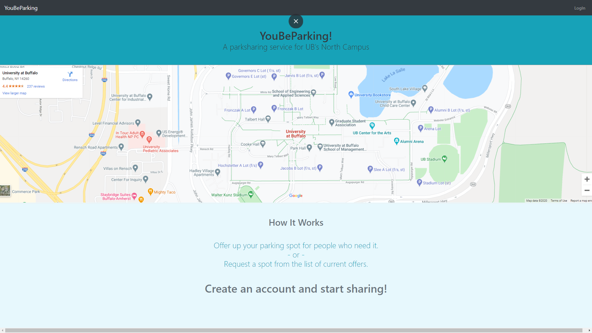

# YouBeParking-UBHacking2020
Parkshare application for UB Hacking 2020



## Dependencies
Frontend (JavaScript)
- axios
- formik
- node.js
- react-bootstrap
- react-iframe
- react-router 
- react.js
- redux

Note: See frontend/package.json for a complete list of our dependencies for JavaScript

Backend (Python)
- aniso8601
- attrs
- bcrypt
- cffi
- click
- Flask
- Flask-Bcrypt
- flask-restx
- Flask-SQLAlchemy
- importlib-metadata
- itsdangerous
- Jinja2
- jsonschema
- MarkupSafe
- pkg-resources
- pycparser
- pyrsistent
- pytz
- six
- SQLAlchemy
- Werkzeug
- zipp

Note: See backend/requirements.txt for a complete list of our depencies for Python

## How to build
### Backend (Python)
1. Go into the backend folder
```
$ cd backend
```
2. Create a python 3 virtual environment
```
$ python3 -m venv env
```
3. Source the virtual environment
```
$ source env/bin/activate/
```
4. Download and install python libraries
```
$ pip install -r requirements.txt
```
5. Run the flask application
```
$ python run.py
```
### Frontend (JavaScript)
1. Go into the frontend folder
```
$ cd frontend
```
2. Install frontend dependencies
```
$ npm install
```
3. Start the react application
```
$ npm run build
```

## References
- [react-bootstrap reference](https://react-bootstrap.github.io/)
- [flask reference](https://flask.palletsprojects.com/en/1.1.x/)
- [flask restx reference](https://flask-restx.readthedocs.io/en/latest/)
- [flask sqlalchemy reference](https://flask-sqlalchemy.palletsprojects.com/en/2.x/)